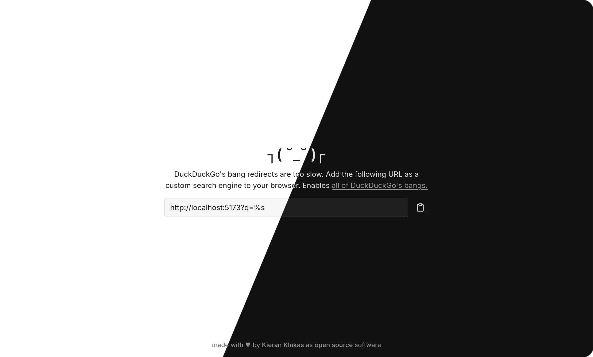
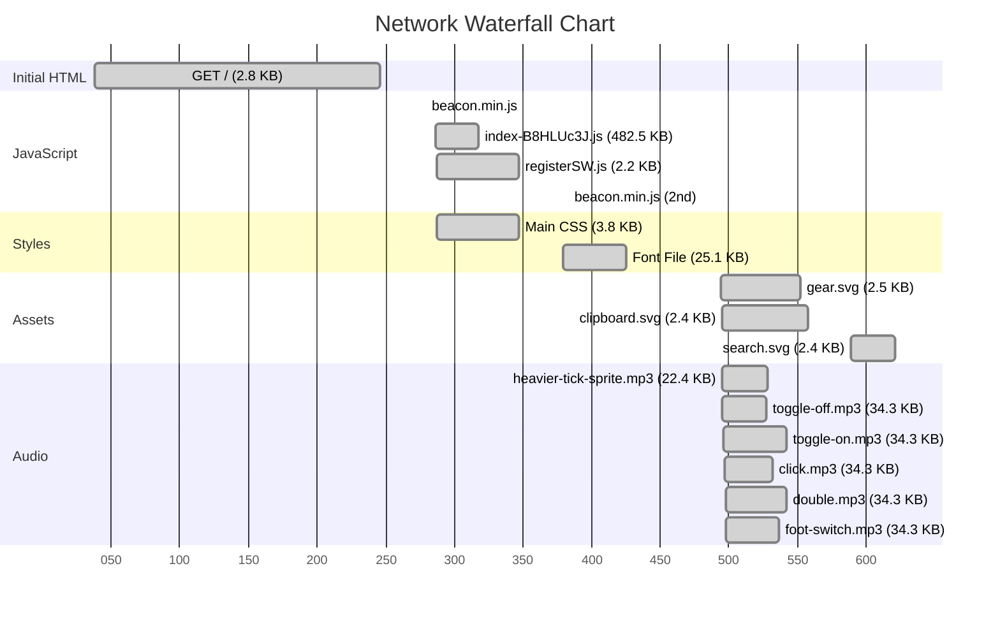
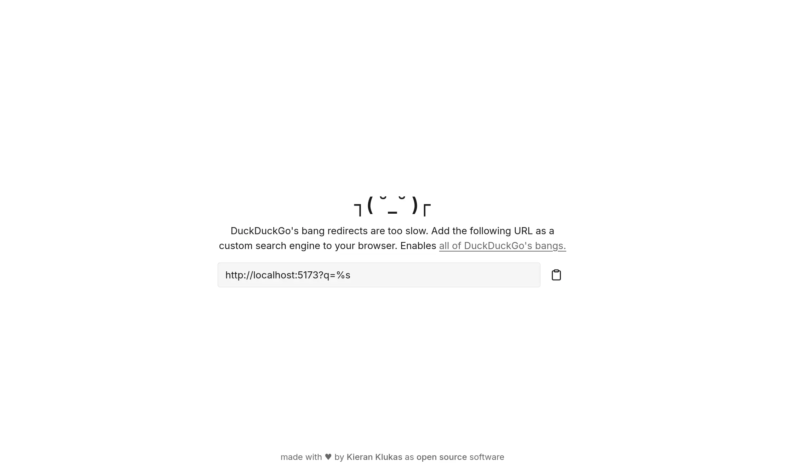
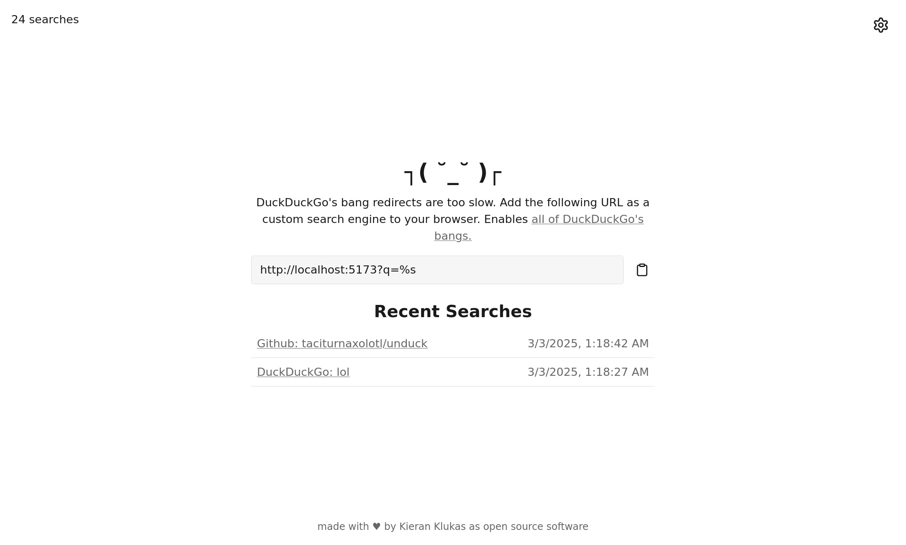
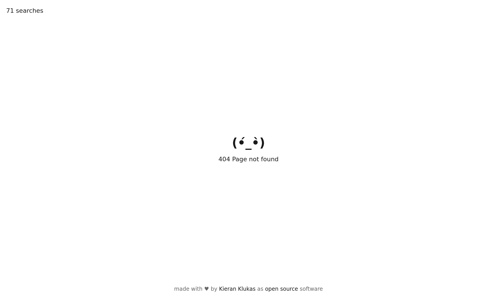
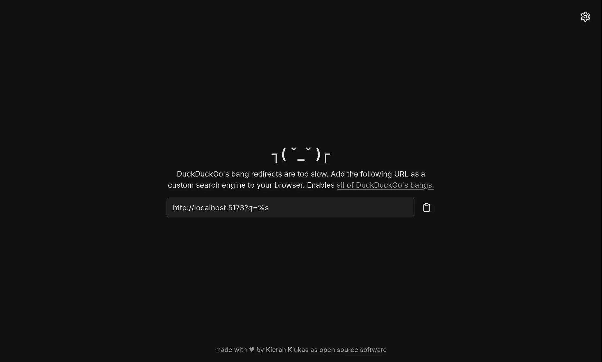
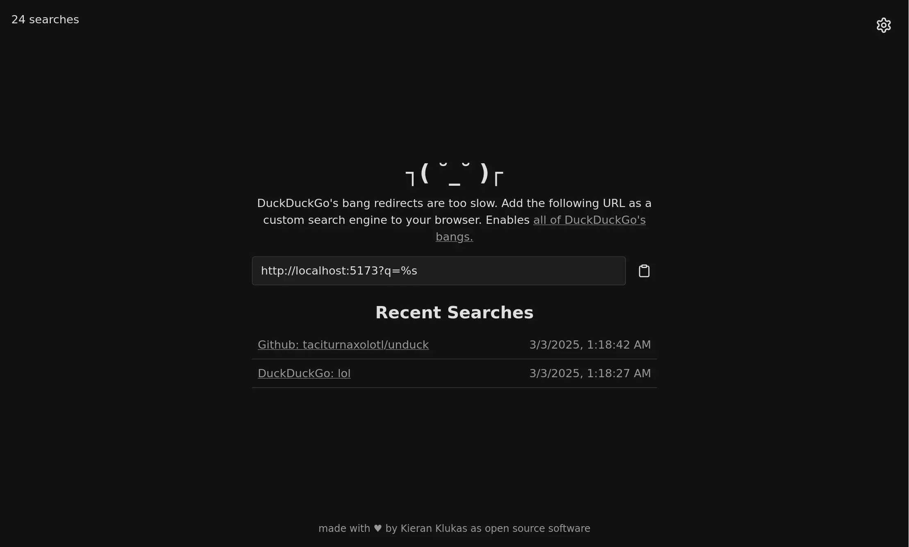
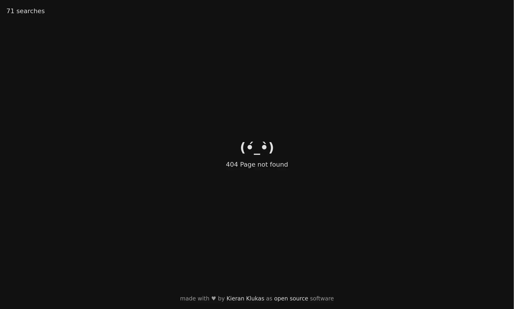

# Unduck



> [!IMPORTANT]
> This is a fork of [t3dotgg/unduck](https://github.com/t3dotgg/unduck). Check out Theo's hosted version at [unduck.link](https://unduck.link) for the original experience.

## Quick Start

Add this URL as a custom search engine to your browser to use DuckDuckGo's bangs, but faster:
```
https://s.dunkirk.sh?q=%s
```

## How is it that much faster?

DuckDuckGo does their redirects server side. Their DNS is...not always great. Result is that it often takes ages.

I solved this by doing all of the work client side. Once you've went to https://s.dunkirk.sh once, the JS is all cache'd and will never need to be downloaded again. Your device does the redirects, not me or any other server.

## How is this different from Theo's version again?

This is primarily my personal fork to experiment with PWAs but I do have a few ideas that I would love to add to this.


- [x] Bangs
- [x] Dark Mode
- [x] Settings (for things like disabling search history and changing default bang)
- [x] Search counter
- [x] [OpenSearch](https://developer.mozilla.org/en-US/docs/Web/XML/Guides/OpenSearch) support
- [x] Search History (clearable, all local, and disabled by default ofc)
- [x] Fancy sounds (disabled if you have `prefers-reduced-motion` set; sounds only account for `198.5 KB` of the `717.4 KB` total size)
- [x] Cute little text animations
- [x] Auto updating bangs file! (I'm using a [GitHub Action](https://github.com/taciturnaxolotl/unduck/actions/workflows/update-bangs.yaml) to update the bangs file every 24 hours)
- [x] Hashmapped bangs for faster searching
- [x] local font file to avoid google fonts
- [x] redirects to the base page of a bang if there is no query (e.g. `!g` will take you to google.com and `!yt` will take you to youtube.com)
- [x] Suffix bangs (e.g. `ghr! taciturnaxolotl/unduck` will take you to this github repo)
- [x] Quick settings (e.g. `!settings` or `!` will take you to the settings page)
- [ ] ~Search suggestions~ (as far as I can tell this essentially impossible to do natively with either firefox or chrome; please correct me if I'm wrong though. In this case I would very much love to be wrong)

and then some more really ambitious stuff like:

> [!NOTE]
> Umm yeah, I know I might not get to all of that and yes this is essentially me finally discovering PWAs and wanting to smash everything into one lol.

- [ ] Omptimistic UI chat wrapper (basically [t3.chat](https://t3.chat) but entirely on your own machine and completely free and unlimited and oss)
- [ ] Meta search engine as the default bang (so you can search Google, Bing, Yahoo, etc. all at once) this one is inspired by [mat-1/metasearch2](https://github.com/mat-1/metasearch2) but without the middleman server.

## Fancy smancy technical graphs 😮

The total size of the app is `717.4 KB` (one time download)

### Resource Breakdown


### Network Performance




## Screenshots

<details>
    <summary>Spoiler Alert: There is both a light and a dark mode 🤯</summary>

### Light Mode





### Dark Mode 💪





</details>

<p align="center">
	
</p>

<p align="center">
	<i><code>&copy 2025-present <a href="https://github.com/taciturnaxolotl">Kieran Klukas</a> forked from <a href="https://github.com/t3dotgg/unduck">t3dotgg/unduck</a></code></i>
</p>

<p align="center">
	<a href="https://github.com/taciturnaxolotl/unduck/blob/main/LICENSE.md"></a>
</p>
